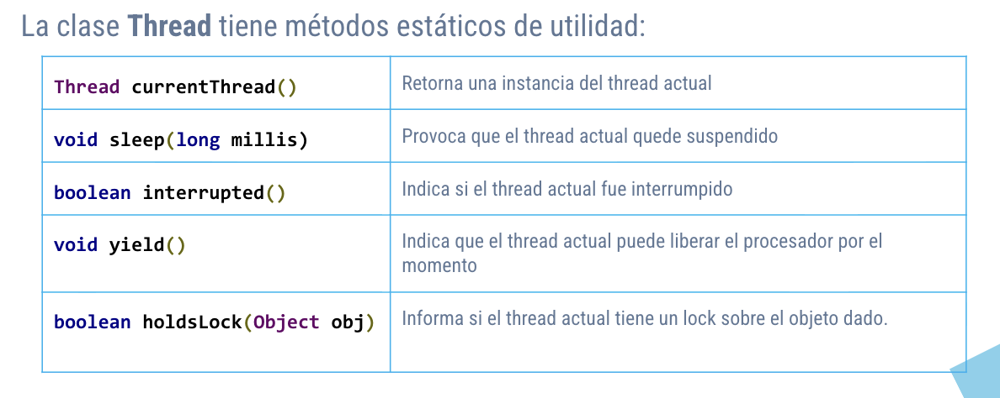

# Programacion concurrente

Mas de una instruccion corriendo "al mismo tiempo". Por ejemplo usando *threads*

Logicamente todo es un tradeoff.

Es muy dificil testear cosas de concurrencia y hay veces que no se puede testear directamente

## Scheduling de procesos

time slicing, context switching, ...

Todo lo que ya sabemos que hace el procesador unicore para dar la ilusion de estar corriendo todo al mismo tiempo

## Scheduling de threads

las partes que pueden correr independientemente esta bueno que corran separado (concurrentemente). Tiene las mismas ventajas que cuando lo hacemos con procesos

Es mas barato crear threads y comunicarlos que crear procesos y comunicarlos via IPC.

Los threads de java mapean 1 a 1 con los threads de un del sistema operativo. Tambien existen virtual threads que son nuevitos y no los vamos a ver.

## Threads en java

`Threads` es una clase que implementa `Runnable`

```java
public class HelloRunnable implements Runnable {
    @Override
    public void run() {
        System.out.println("Hello from a thread!");
    }
    public static void main(String[] args) {
        Thread helloThread = new Thread(new HelloRunnable());
        helloThread.start();
    }
}
```

Hay metodos estaticos en threads que tiran `InterruptedException` y hay que envolverlos en try-catch



```java
public class SleeperRunnable implements Runnable {
    @Override
    public void run() {
        for (int i = 0; i < 10; i++) {
            try {
                System.out.println("Siesta numero: " + i);
                Thread.sleep(1000);
            } catch (InterruptedException e) {
                System.out.println("Interrupted");
                return;
            }
        }
    }
}
```


